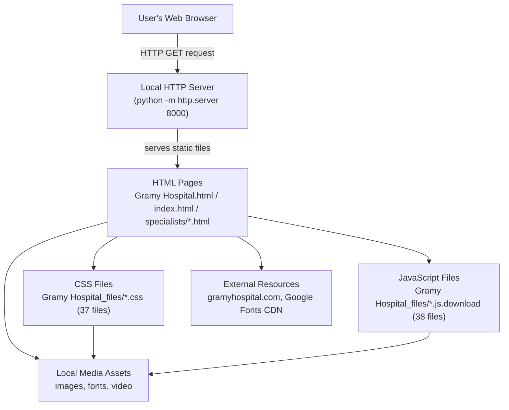
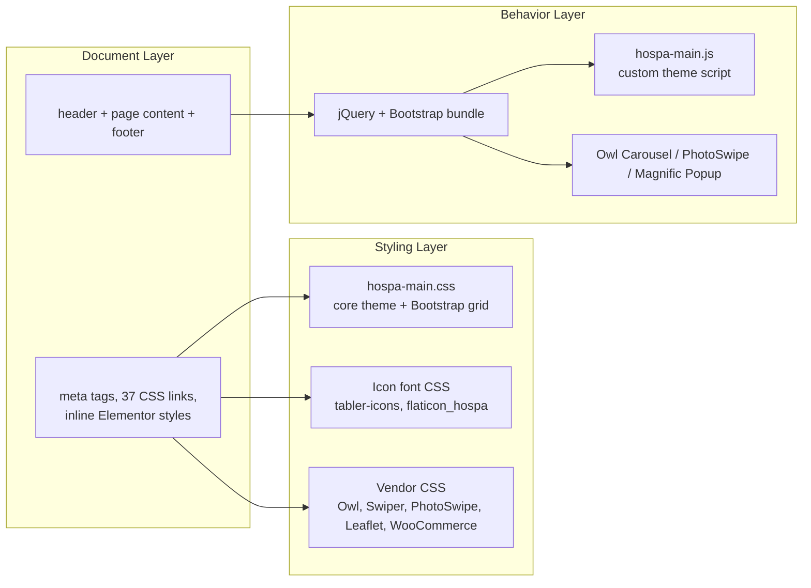
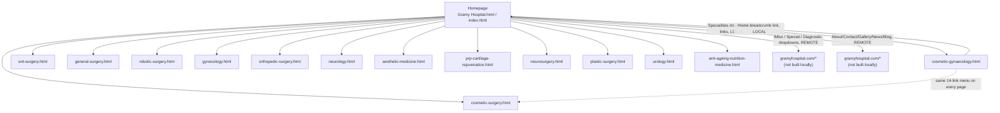
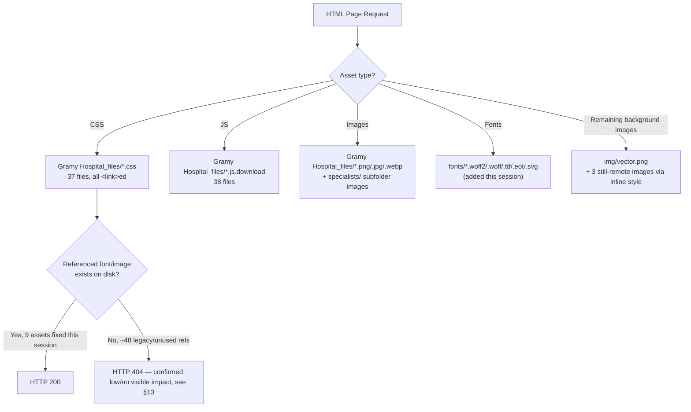
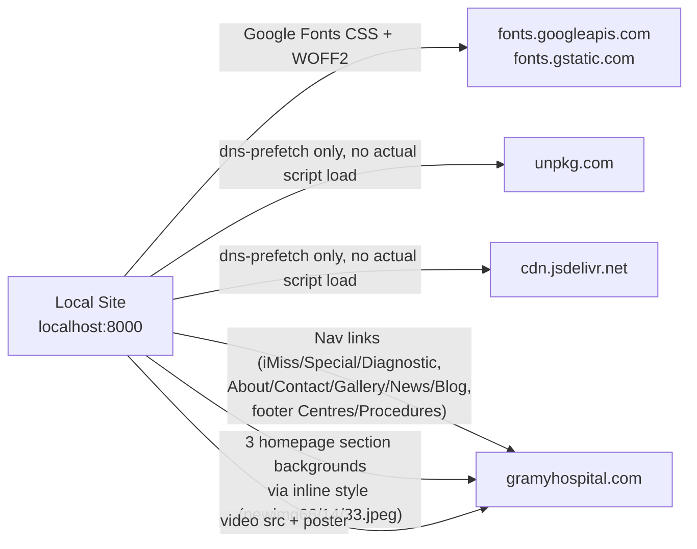
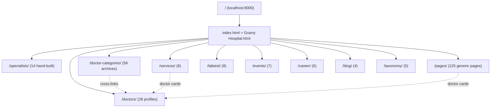
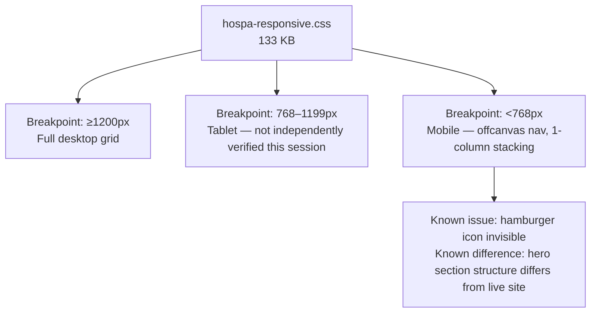
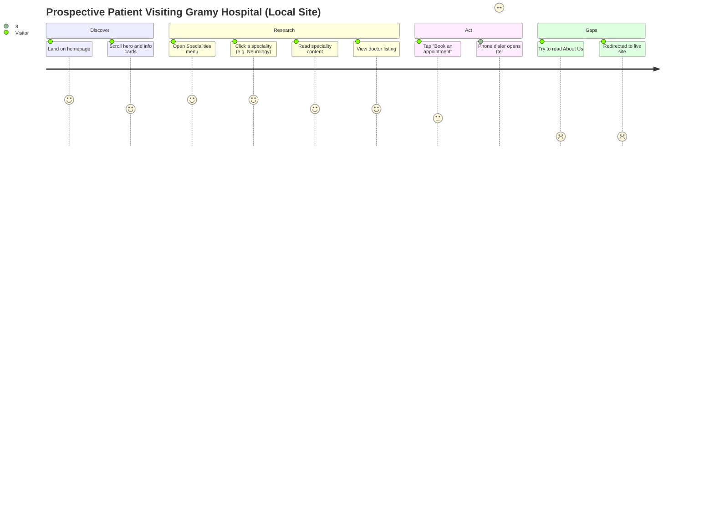
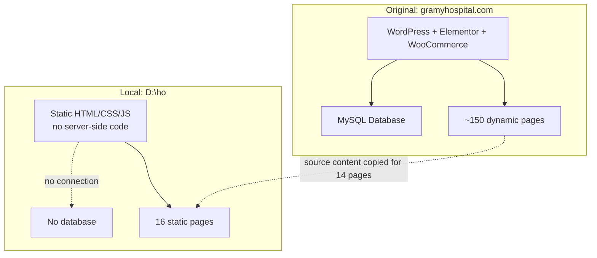

# Gramy Hospital Website — Technical Documentation Report

> **⚠️ Architecture superseded 2026-09-21 (later same day):** everything this report describes below — the static HTML/CSS/JS site, its 265 pages, and the crawl-and-build tooling — was archived unmodified to `legacy-static-site/` and replaced as the project's live architecture by a proper Next.js 14 + TypeScript + App Router application at the project root (`app/`, `components/`, `lib/`, `data/`, `public/`). The static build remains fully intact inside `legacy-static-site/` for reference (nothing was deleted), and all of its extracted content (`tools/all_pages_data.json`, `tools/specialists_data.json`) was reused as the new app's data source rather than being redone from scratch. Run `npm install && npm run dev` from `D:\ho` to use the current site. The rest of this document is a historical record of the static build and no longer describes what's deployed.

**Project location:** `D:\ho`
**Report generated:** 2026-09-18 (updated 2026-09-21 — full-site crawl and page build-out)
**Report type:** Technical audit plus a full-site build session: every page in the live site's WordPress sitemap (264 URLs across 12 content types) was crawled, content-extracted, and rendered into a local static page
**Reference site for comparison:** https://gramyhospital.com/
**Local site under test:** http://localhost:8000/ (served via `python -m http.server 8000` from `D:\ho`)

---

## 1. Executive Summary

| Item | Detail |
|---|---|
| **Project name** | Gramy Hospital — Local Website Replica |
| **Project purpose** | A local, static front-end reproduction of the Gramy Hospital hospital website, built from a browser-saved snapshot of the live site, 14 hand-built specialist inner pages, and (as of 2026-09-21) a full crawl-and-generate pass covering every other page discoverable in the live site's sitemap |
| **Project type** | Static HTML/CSS/JavaScript website. No server-side application code, no database, no build tool |
| **Current implementation status** | Homepage reproduced from the original save; all 14 "Specialities" pages hand-built; **249 additional pages** generated from a live sitemap crawl covering generic content pages, doctor profiles, services, lab tests, careers, events, blog posts, and doctor-category archives. Theme demo pages (`home-two`…`home-ten`, `home-demo`, `about-two`) and WooCommerce/account scaffolding (`cart`, `checkout`, `my-account`, `login`, `register`, `profile`) were included per project scope but render with placeholder/minimal content since they have no functioning backend |
| **Main technologies used** | HTML5, CSS3, vanilla JavaScript, jQuery, Bootstrap 5 (CSS grid only, bundled inside theme CSS), Elementor page-builder output (static), Owl Carousel, Swiper, PhotoSwipe, Magnific Popup, Leaflet (loaded, unused), WooCommerce front-end assets (loaded, unused) |
| **Number of pages** | **265 real pages**: 1 homepage (duplicated as `Gramy Hospital.html` and `index.html`, byte-identical) + 14 hand-built specialist pages + 249 crawl-generated pages (125 generic `pages/`, 28 `doctors/`, 58 `doctor-categories/`, 8 `services/`, 8 `labtest/`, 7 `events/`, 6 `career/`, 4 `blog/`, 5 `taxonomy/`). See §6 and §9 for the full breakdown. |
| **Major features** | Responsive homepage with hero slider, service grid, lab-test carousel, testimonial carousel, blog preview, mega-menu navigation now resolving to local pages across nearly all of it (see §13); 14 hand-built specialist inner pages; 28 individual doctor profile pages (qualifications, experience, phone, location, areas of expertise, bio) cross-linked from every doctor-card grid site-wide; 58 doctor-category archive pages; full generic-page coverage (About, Contact, Gallery, FAQs, ~40 treatment/procedure pages, ~9 department pages, policy pages, careers, events, blog) |
| **Current limitations** | No backend, no database, no working contact form or site search (forms are omitted; a placeholder note + phone link is shown where a page's only content was a form), theme demo pages and WooCommerce/account pages are content-empty by nature (documented, not a bug), a handful of hero/body images (34 of 315 unique live images) are 404 on the live site itself and are simply omitted locally, one unresolved rendering issue carried over from the original build (mobile hamburger icon invisible) |
| **Overall technical condition** | Functionally stable as a static site: serves correctly over HTTP; a full reference-check across all 263 local HTML pages found **zero broken internal links, nav hrefs, or asset references** (458 unique local references checked — see §13) |
| **Original vs local summary** | The site is now breadth-complete: every page type in the live site's sitemap has at least one corresponding local page, generated via a simplified semantic template (real extracted text/images/data, theme CSS classes, but not byte-exact Elementor markup — see §9 for the trade-off). The homepage and 14 specialist pages remain the highest-fidelity pages (hand-built); the 249 crawl-generated pages trade some layout nuance for full site coverage |

---

## 2. Project Overview

From a visitor's perspective, this is a hospital marketing/information website for "Gramy Hospital," a facility in Mumbai. It presents:

- **Target users:** prospective patients researching the hospital's specialities, doctors, and services; existing patients looking for contact/location information; general visitors browsing hospital credentials and facilities.
- **Main purpose:** build trust in the hospital's expertise, list its medical specialities, introduce doctors, and drive phone-based appointment requests (there is no online booking form — every call-to-action is a `tel:` link).
- **Main sections (homepage):** hero banner, "Visitor Information / Find a Doctor / Our Locations / Connect With Us" quick-link cards, About Hospital, Our Services (8-card grid), Why Choose Gramy, Lab Test Facilities carousel, testimonials, Download App promo, Healthcare Solution CTA, Blog & Articles preview, footer.
- **Navigation flow:** top navigation bar with a "Specialities" mega-menu (14 items, now pointing to local pages), plus "iMiss," "Special," and "Diagnostic" dropdowns that still point to the live site (out of this project's build scope), and top-level links to About Us / Contact Us / Gallery / News / Blog (also still pointing live, since those pages were never built locally).
- **Doctor/specialist information:** each of the 14 local specialist pages lists the real doctor(s) associated with that speciality (name, photo, designation) sourced directly from the live site — see §9.
- **Contact/appointment functionality:** phone-only. Every "Call Us Now," "Book an appointment," and "Schedule a Test" button is a `tel:` link (`tel:02235347300` / `tel:022-35347300`). No web form exists anywhere in the project (verified: zero `<form>` elements in any HTML file).
- **Other functionality discovered:** an embedded local video testimonial (via `<video>`, sourced from a remote URL — see §12), a photo-lightbox gallery (PhotoSwipe), and carousels (Owl Carousel for hero/services/lab-test, Swiper library also loaded).

---

## 3. Technology Stack

| Technology | Version (if detectable) | Purpose | Where Used | Status |
|---|---|---|---|---|
| HTML5 | — | Markup for all 16 pages | Every `.html` file | Actually used |
| CSS3 | — | All visual styling | 37 `.css` files in `Gramy Hospital_files/` | Actually used |
| JavaScript (vanilla) | — | Custom theme interactions | `hospa-main.js.download` | Actually used |
| jQuery | Bundled, version not printed in filename | DOM manipulation, plugin dependency base | `jquery.min.js.download`, `jquery-migrate.min.js.download` | Actually used |
| Bootstrap | 5.x (grid/utility classes present: `col-lg-*`, `offset-lg-*`, `.container`, `.row`) | Grid system, embedded inside `hospa-main.css`; separate JS bundle also loaded | `bootstrap.bundle.min.js.download` | Actually used |
| Elementor (page-builder output) | Kit ID `elementor-kit-12`; eicons v5.53.0 referenced | The original site was built with the Elementor WordPress plugin; this project contains its **static HTML/CSS output only** — no Elementor editor or WordPress runtime is present | Throughout `Gramy Hospital.html`, `index.html`, all 14 specialist pages (via shared header/footer markup) | Present as static output only; not "implemented" as software |
| Elementor icon font (eicons) | v5.53.0 | Bundled with Elementor's CSS | `elementor-icons.min.css` | Present but unused — zero `eicon-` classes found in any page |
| Tabler Icons | v2.46.0 | Primary icon set (nav carets, card icons, buttons, social icons) | `tabler-icons.min.css`; 72 `ti ti-*` class usages on the homepage | Actually used — font files fixed and verified this session |
| Flaticon (custom "Flaticon Hospa" set) | Custom, unversioned | Secondary icon set | `flaticon_hospa.css`; 6 `flaticon-*` class usages | Actually used — font files fixed and verified this session |
| Font Awesome | v4.7.0 (`font-awesome.min.css`) and v5 free (`brands.css` / `solid.css`) | Bundled by the theme | `font-awesome.min.css`, `fontawesome.css`, `brands.css`, `solid.css` | Present, referenced from theme; **zero `fa`/`fas`/`fab` classes found** — unused |
| Owl Carousel | 2.3.4 | Doctor-card slider, lab-test carousel | `owl.carousel.min.js.download`, used via `owl-carousel` classes | Actually used |
| Swiper | Bundled | Loaded by the theme/Elementor | `swiper-bundle.min.js.download`, `swiper-bundle.min.css` | Present; no `swiper-container`/`swiper-wrapper` elements found in current markup — **not verified as actively rendering a slider on these pages** |
| PhotoSwipe | Bundled | Image lightbox gallery | `photoswipe.min.js.download`, `photoswipe-ui-default.min.js.download`, `default-skin.min.css` | Actually used — lightbox template and 2 trigger links confirmed present in the homepage markup |
| Magnific Popup | Bundled | Popup/lightbox helper | `magnific-popup.min.js.download` | Present; loaded alongside PhotoSwipe — **not fully verified which specific elements it drives** |
| Leaflet | Bundled | Map library | `leaflet.js.download`, `leaflet.css` | Present but unused — zero `#map`/`leaflet-container` elements found; "Our Locations" is a static text card, not an interactive map |
| WooCommerce front-end assets | Bundled | E-commerce cart/checkout UI | `woocommerce.css`, `woo-products.css`, `woocommerce-layout.css`, `add-to-cart.min.js.download`, `jquery.blockUI.min.js.download`, `sourcebuster.min.js.download`, `order-attribution.min.js.download` | Present, fully unused — no cart, checkout, or product page exists in this project |
| Google Fonts (Libre Franklin, Roboto) | — | Body and heading typography | Linked via `<link>` in `<head>`, and `Gramy Hospital_files/css2`, `css(1)` | Actually used (externally hosted — see §12 performance/§25 limitations for a font-fallback issue observed) |
| WordPress-origin metadata | — | oEmbed links, `xmlrpc.php` pingback link, RSS feed links, `wp-json` REST links | Present in `<head>` of every page | Referenced from the original site only — none of these WordPress endpoints exist or function locally |
| PHP | — | Not present | — | Not implemented — no `.php` file exists anywhere in the project |
| Image formats | PNG, JPEG/JPG, WebP, SVG, GIF (referenced, not present locally) | Photography and icons | `Gramy Hospital_files/`, `specialists/`, project root | Actually used (PNG/JPEG/WebP present; GIF referenced but missing — see §12) |
| Video formats | MP4 | Homepage testimonial video | `WhatsApp-Video-2026-08-19-at-11.35.31-PM.mp4` (present locally, 16.3 MB, but the `<video>` tag references the **remote** copy — see §12) | Present locally but not referenced locally |
| Font formats | WOFF2, WOFF, TTF, EOT, SVG (font) | Icon and text fonts | `fonts/` (added this session), `Gramy Hospital_files/*.css` `@font-face` rules | Mixed — see §12 for the full breakdown |

---

## 4. Programming / Markup / Style Languages

### HTML
- **Role:** structural markup for all 16 real pages.
- **Main files:** `Gramy Hospital.html` (2,561 lines), `index.html` (byte-identical copy), 14 files under `specialists/`.
- **Approximate usage:** the homepage is a single very large HTML document (≈227 KB) combining a WordPress/Elementor-generated `<head>`, a shared header/footer, and homepage-specific sections. Each specialist page (≈120–133 KB) reuses the same head/header/footer verbatim plus page-specific breadcrumb, body content, and a doctor-card grid.

### CSS
- **Role:** all visual styling — no CSS-in-JS, no CSS preprocessor output detected (no `.scss`/`.less` source files present, only compiled `.css`).
- **Main stylesheets:** `hospa-main.css` (652 KB — the theme's core stylesheet, includes the embedded Bootstrap grid), `hospa-responsive.css` (133 KB), `hospa-new-demo.css`, `hospa-blog.css`, `hospa-woocommerce.css`, `hospa-mobile-navbar.css`, plus Elementor's `frontend.css`/`frontend.min.css` and 20+ smaller vendor stylesheets (Owl Carousel, Swiper, PhotoSwipe, Magnific Popup, Leaflet, WooCommerce, Font Awesome, Tabler Icons, Flaticon, Elementor icons).
- **Major styling systems:** a Bootstrap 5 grid (container/row/col-lg-\*) embedded directly inside `hospa-main.css`; CSS custom properties for theme colors (`--mainColor: #9588E8`, `--optionalColor: #0B55E5`); Elementor's own utility classes (`elementor-section`, `elementor-container`, `elementor-widget-wrap`).

### JavaScript
- **Role:** carousel/slider behavior, mobile menu toggling (via Bootstrap's offcanvas component), lightbox galleries, and various WooCommerce/Elementor runtime scripts that are loaded but structurally inert on this project (no cart, no Elementor editor).
- **Main scripts:** `hospa-main.js.download` (the theme's own custom script — 7 KB), `bootstrap.bundle.min.js.download`, `owl.carousel.min.js.download`, `photoswipe.min.js.download` + `photoswipe-ui-default.min.js.download`, `magnific-popup.min.js.download`, `swiper-bundle.min.js.download`.
- **Interactive functionality confirmed:** mega-menu dropdowns (CSS `:hover` + `data-hover="dropdown"`), mobile offcanvas menu trigger (`data-bs-toggle="offcanvas"`), hero image carousel, doctor-card carousel, lab-test carousel, PhotoSwipe lightbox trigger elements. See §14 for the full table.

### PHP / backend-related code
- **Not implemented locally.** No `.php` file exists anywhere in `D:\ho` (verified by a project-wide filename search). All WordPress-style references (`/wp-admin/admin-ajax.php`, `xmlrpc.php`, `wp-json` REST endpoints) are **static text left over from the original page save** — they are URLs pointing at `gramyhospital.com`'s real WordPress backend, not functionality present in this project. Clicking or triggering any of them would hit the live site, not a local server.

### JSON / configuration formats
- `tools/specialists_data.json` — the structured content data (titles, body text, doctor lists, image URLs) extracted from the live site and used to generate the 14 specialist pages. This is project tooling, not part of the served website.
- `package-lock.json` (81 bytes, at project root) — an empty npm lockfile stub (`"packages": {}`). No corresponding `package.json` exists anywhere in the project, and no `node_modules` directory exists. **Not verified** what originally created this file; it has no effect on the site.

---

## 5. System Architecture

### A. High-Level System Architecture



### B. Frontend Architecture



### C. Page Navigation Architecture



### D. Asset Loading Architecture



### E. External Dependency Architecture



---

## 6. Website Page Structure

### Page Inventory

| # | File | Page Title | Purpose |
|---|---|---|---|
| 1 | `Gramy Hospital.html` | Gramy Hospital | Homepage |
| 2 | `index.html` | Gramy Hospital | Homepage (byte-identical duplicate, serves as the default document for `http://localhost:8000/`) |
| 3 | `specialists/cosmetic-gynaecology.html` | Cosmetic Gynaecology – Gramy Hospital | Speciality page |
| 4 | `specialists/cosmetic-surgery.html` | Cosmetic Surgery – Gramy Hospital | Speciality page |
| 5 | `specialists/ent-surgery.html` | ENT Surgery – Gramy Hospital | Speciality page |
| 6 | `specialists/general-surgery.html` | General Surgery – Gramy Hospital | Speciality page |
| 7 | `specialists/robotic-surgery.html` | Robotic Surgery – Gramy Hospital | Speciality page |
| 8 | `specialists/gynecology.html` | Gynecology – Gramy Hospital | Speciality page |
| 9 | `specialists/orthopedic-surgery.html` | Orthopedic Surgery – Gramy Hospital | Speciality page |
| 10 | `specialists/neurology.html` | Neurology – Gramy Hospital | Speciality page |
| 11 | `specialists/aesthetic-medicine.html` | Aesthetic Medicine – Gramy Hospital | Speciality page |
| 12 | `specialists/prp-cartilage-rejuvenation.html` | PRP & Cartilage Rejuvenation – Gramy Hospital | Speciality page |
| 13 | `specialists/neurosurgery.html` | Neurosurgery – Gramy Hospital | Speciality page |
| 14 | `specialists/plastic-surgery.html` | Plastic Surgery – Gramy Hospital | Speciality page |
| 15 | `specialists/urology.html` | Urology – Gramy Hospital | Speciality page |
| 16 | `specialists/anti-ageing-nutrition-medicine.html` | Anti-Ageing Nutrition Medicine – Gramy Hospital | Speciality page |

Every page shares: the same `<head>` (CSS links, meta), the same header/mega-menu, and the same footer. Specialist pages additionally share a breadcrumb-banner component and a doctor-card grid component. See §7 for the 5 non-page template fragment files.

### Crawl-Generated Pages (added 2026-09-21)

A full crawl of the live site's WordPress sitemap (`/wp-sitemap.xml` and its 15 sub-sitemaps, 264 URLs total after excluding 22 internal Elementor header/footer/block-library entries that aren't real navigable pages) was used to generate 249 additional local pages, organized by content type:

| Folder | Count | Source (live sitemap) | Content |
|---|---|---|---|
| `pages/` | 125 | `wp-sitemap-posts-page-1.xml` (minus 14 specialists + homepage) | About, Contact, Gallery, FAQs, ~40 treatment/procedure pages, ~9 department overview pages, policy pages, careers/volunteers, theme demo pages, WooCommerce/account pages |
| `doctors/` | 28 | `wp-sitemap-posts-doctors-1.xml` | Individual doctor profiles: photo, tags, qualifications/experience/phone/location/hospitals, areas of expertise, About bio |
| `doctor-categories/` | 58 | `wp-sitemap-taxonomies-doctors_cat-1.xml` | Fine-grained doctor-specialty archive pages (e.g. "Urologist", "Robotic Surgeon"), each listing the matching doctor(s), cross-linked to `doctors/` |
| `services/` | 8 | `wp-sitemap-posts-services-1.xml` | Department/service overview pages |
| `labtest/` | 8 | `wp-sitemap-posts-labtest-1.xml` | Diagnostic/lab test pages |
| `events/` | 7 | `wp-sitemap-posts-event-1.xml` | Hospital event pages (date/time/location + overview) |
| `career/` | 6 | `wp-sitemap-posts-career-1.xml` | Job posting pages |
| `blog/` | 4 | `wp-sitemap-posts-post-1.xml` | Blog articles |
| `taxonomy/` | 5 | remaining small taxonomies (blog category/tag, doctor facility, services category) | Archive/listing pages |

All 249 pages reuse the exact same shared `<head>`/header/footer template blocks as the hand-built specialist pages (see §9 for the extraction/generation method and its fidelity trade-offs versus the original Elementor markup).

### Page Hierarchy Diagram



---

## 7. Folder and File Structure

Generated from the actual filesystem on 2026-09-18 (top two levels; `Gramy Hospital_files/` contents summarized due to size — 125 files):

```
D:\ho
├── Anti-aging-Medicine-and-Wellness-800x530.png     (unreferenced by any page — orphan)
├── Cosmetic-Gynecology-800x530.png                  (unreferenced by any page — orphan)
├── GRAMY_HOSPITAL_TECHNICAL_REPORT.md               (this report)
├── Gramy Hospital.html                              (homepage, 226,960 bytes)
├── Gramy Hospital_files/                            (125 files — CSS, JS, images; see below)
│   └── specialists/                                 (24 images downloaded for the 14 specialist pages)
├── IMG-20260729-WA0010.jpg                          (unreferenced by any page — orphan)
├── Surgical-Oncology-800x530.png                    (unreferenced by any page — orphan)
├── WhatsApp-Video-2026-08-19-at-11.35.31-PM.mp4     (16.3 MB — present locally but not referenced locally, see §12)
├── fonts/                                           (8 files — added this session)
├── img/                                             (1 file — vector.png, added this session)
├── index.html                                       (homepage duplicate, byte-identical to Gramy Hospital.html)
├── newimg13-4.png                                   (unreferenced by any page — orphan)
├── newimg48-scaled.jpeg                             (unreferenced by any page — orphan)
├── newimg60-scaled.jpeg                             (unreferenced by any page — orphan)
├── package-lock.json                                (81 bytes, empty stub — no package.json exists)
├── specialists/                                     (14 HTML files, the specialist inner pages)
└── tools/                                           (10 files — build/audit scripts, not part of the served site)
    └── template-blocks/                             (5 HTML fragments used to generate specialist pages)
```

### Folder-by-folder explanation

| Folder | Purpose | File types | Actively used? |
|---|---|---|---|
| `Gramy Hospital_files/` | The original browser-saved asset bundle: every CSS, JS, and image the homepage (and, by extension, the specialist pages) depends on | `.css` (37), `.js.download` (38 — the `.download` suffix is an artifact of how Chrome saved these), `.png`/`.jpg`/`.jpeg`/`.webp`/`.svg` images, plus 4 oddly-named files (`css`, `css2`, `css(1)`, `css(2)`) which are Google Fonts CSS saved without an extension | Yes — this is the site's entire styling/scripting/image foundation |
| `Gramy Hospital_files/specialists/` | Images specifically downloaded for the 14 specialist pages (hero photos, doctor photos) | `.jpeg`, `.png` (24 files) | Yes |
| `specialists/` | The 14 specialist inner pages built this session | `.html` (14) | Yes |
| `tools/` | Python scripts and data used to build/verify/audit the site (content extraction, page generation, link patching, asset checking) | `.py` (9 scripts), `.json` (1 data file) | Build/maintenance tooling only — **not served to website visitors** |
| `tools/template-blocks/` | The 5 reusable HTML fragments (head, body-open, header, footer, closing scripts) that `generate_specialists.py` assembles into each specialist page | `.html` (5 fragments — not standalone pages) | Source-of-truth for regenerating specialist pages; not served directly |
| `fonts/` | Icon font binaries fetched from the live site this session, matching the path the existing CSS already expected (`../fonts/...`) | `.woff2`, `.woff`, `.ttf`, `.eot`, `.svg` (8 files) | Yes — fixes the Tabler Icons and Flaticon Hospa icon sets |
| `img/` | A single decorative background image (`vector.png`) fetched this session, matching the CSS's `../img/...` path | `.png` (1 file) | Yes — used by the homepage's 8 "Our Services" cards |

### Orphaned root-level files
`Anti-aging-Medicine-and-Wellness-800x530.png`, `Cosmetic-Gynecology-800x530.png`, `Surgical-Oncology-800x530.png`, `IMG-20260729-WA0010.jpg`, `newimg13-4.png`, `newimg48-scaled.jpeg`, `newimg60-scaled.jpeg`, and `WhatsApp-Video-2026-08-19-at-11.35.31-PM.mp4` sit at the project root but are **not referenced by any HTML file** — identical copies of the images (except the video) exist and are actually used inside `Gramy Hospital_files/`. These appear to be leftover duplicates from the original save process.

---

## 8. Homepage Analysis

Section-by-section breakdown of `Gramy Hospital.html` / `index.html`, in document order:

### Header
- **Structure:** a thin top bar ("Plan your visit by scheduling an appointment...") + main nav row (logo, About Us/Contact Us/Gallery/News/Blog links, mega-menu, Emergency button) + a duplicate offcanvas menu for mobile.
- **CSS classes:** `.top-header-area`, `.navbar`, `.mega-menu`, `.dropdown-toggle`, `.mobile-navbar.offcanvas`.
- **JavaScript:** Bootstrap's dropdown/offcanvas components (`data-bs-toggle="offcanvas"`, `data-hover="dropdown"`).
- **Images:** `gramy-hospital.png` logo (2 instances — standard + mobile).
- **Links/buttons:** 14 Specialities links (local), iMiss/Special/Diagnostic dropdown items (remote), Emergency `tel:` button.
- **Responsive behavior:** mobile nav toggle button is present and wired to Bootstrap's offcanvas JS, but its 3-bar visual indicator (`.burger-menu` with `.top-bar`/`.middle-bar`/`.bottom-bar` spans) does not render visibly at 390px width in verification screenshots — see §11 and §25.

### Hero
- **Structure:** an Owl Carousel with 3 slides, each with a heading, subtext, and a "Call us now" button, plus a reception-desk photo and a "FIND A LOCATION" info bar.
- **CSS classes:** `.hero-slider`/`owl-carousel` (exact class name not independently re-verified in this pass — **not verified**), `.default-btn`.
- **Images:** reception desk photo (local); the "FIND A LOCATION" bar background uses an inline-styled image loaded from the live site (`newimg66.jpeg`, confirmed reachable — see §13).
- **Buttons:** "Call Us Now" (`tel:` link).

### Visitor Info Cards (4-card row)
- **Structure:** "Visitor Information / Find a Doctor / Our Locations / Connect With Us," each a colored rounded card with an icon, text, and "Learn More" link.
- **Icons:** Tabler Icons (`ti ti-*`) — confirmed rendering correctly after this session's font fix.
- **Links:** all 4 "Learn More" links point to pages that don't exist locally (`/visitor-information/`, `/find-a-doctor/`, `/find-a-location/`, `/contact-us/`) — **not verified** whether these resolve to `gramyhospital.com` absolute URLs or broken local paths; based on the pattern established elsewhere in the project (out-of-scope links left as absolute `https://gramyhospital.com/...`), these are presumed remote.

### About Hospital
- **Structure:** two-column layout — text block (heading, paragraph, 8-item checklist, "More About Us" button) + image with two floating stat badges ("22 Different Sections," "5K+ Patient's Reviews").
- **CSS class:** confirmed present via a real embedded testimonial `<video>` element nearby (see §12).
- **Icons:** Tabler checkmark icons on each of the 8 list items.

### Our Services (8-card grid)
- **Structure:** "Radiology, Sonography, Microbiology, Surgery, Orthopedic, Neurology, Pathology, Anti-Ageing Nutrition Medicine" — 8 identical cards, each with an icon, heading, description, and "Read More" link.
- **Icons:** real downloaded PNG images (`pro-img3.png`, `pro-img6.png`, `pro-img4.png`, `syringe.png`, `bone.png`, `dna.png`, `pro-img8.png`, `pill.png`) — **not** font icons; confirmed rendering correctly in visual verification.
- **Decorative background:** `.services-card::after` uses `img/vector.png`, fixed this session.
- **Links:** 3 of the 8 cards (Surgery→General Surgery, Neurology, Anti-Ageing Nutrition Medicine) point to local specialist pages (fixed this session); the other 5 point to `/services-post/...` paths that don't exist locally.

### Why Choose Gramy (3-icon row)
- **Structure:** "Patient-Centered Care / Advanced Medical Excellence / Comprehensive Specialty Care," each with a colored snowflake-style icon and a "Learn More" link.
- **Icons:** real downloaded PNG images (`img1.png`, `img2.png`, `img3.png`).

### Lab Test Facilities
- **Structure:** a photo card ("Patient Care Excellence" badge over a surgical photo) beside a light-gray carousel box listing 8 lab tests (Orthopedists Test, Ultrasound, Prothrombin Time, Hemoglobin A1C, MRI & CT Scan, X-Rays, Urinalysis, Blood Test), each with a discount badge and "Schedule A Test" `tel:` button.
- **Background image:** `.lab-test-image` has both a (dead, unused) CSS default and a working inline-style image (`newimg14.jpeg`, confirmed reachable) — see §13.

### Testimonials / "Expertise with Excellence"
- **Structure:** a large heading, a Google-rating badge ("4.9" with a star icon), two photos, and a carousel of patient quotes with reviewer name and photo.
- **Carousel:** Owl Carousel, confirmed present via prev/next arrow buttons in markup.

### Download App promo
- **Structure:** "500+ Doctors" badge, app-store/play-store badge links (both point to placeholder `#` anchors, now resolving locally per this session's fix — they don't navigate anywhere functional, but no longer leave the page).

### Healthcare Solution CTA
- **Structure:** a dark full-width banner ("Your Health Is Our Top Priority") over a photo background.
- **Background image:** `.solution-inner` — same dead-CSS/working-inline-style pattern as above (inline image `newimg33.jpeg`, confirmed reachable).

### Blog & Articles
- **Structure:** 3 blog preview cards (Cosmetic Gynecology, Anti-aging Medicine, Surgical Oncology articles) with image, category tag, date, read time, and "Read More" — plus a "We have 1 more Articles. View All" bar.
- **Links:** all 3 article links and the "View All" link point to `gramyhospital.com` — no blog pages exist locally.

### Footer
- **Structure:** 5 columns — For Patient, Centres of Excellence, Top Procedures, Corporate, Social Media — plus a locations/hours block, an advisory notice, and a copyright line.
- **Links:** all footer links (except "Privacy Policy," which resolves locally to nowhere either — **not verified** if a local privacy-policy page exists; confirmed it does not) point to `gramyhospital.com`.
- **Confirmed matching the live site closely** in structure and text (see §21).

---

## 9. Specialist / Inner Page Analysis

All 14 pages were inspected. Every page shares the same structural template (breadcrumb banner → hero image, if present → body content → "Available Doctors under [Speciality]" card grid → footer), generated from `tools/template-blocks/` + `tools/specialists_data.json` via `tools/generate_specialists.py`.

| Page | Title | Main Content | Images | Doctor Cards | Unique Features / Issues |
|---|---|---|---|---|---|
| `cosmetic-gynaecology.html` | Cosmetic Gynaecology | 9 content blocks (headings/paragraphs/lists) | Hero image present | 1 | — |
| `cosmetic-surgery.html` | Cosmetic Surgery | 8 content blocks | Hero image present | 3 | — |
| `ent-surgery.html` | ENT Surgery | 21 content blocks (longest structured article, with numbered lists) | Hero image present | 3 | Most heading-rich page (6 subheadings) |
| `general-surgery.html` | General Surgery | 16 content blocks, plain-paragraph style (no subheadings) | Hero image present | 1 | — |
| `robotic-surgery.html` | Robotic Surgery | 33 content blocks (most content of any page) | **No hero image** — source `robotic-surgery.webp` returns HTTP 404 on the live site itself | 4 | — |
| `gynecology.html` | Gynecology | 17 content blocks, plain-paragraph style | Hero image present | 2 | — |
| `orthopedic-surgery.html` | Orthopedic Surgery | 25 content blocks | **No hero image** — source `orthopedic-surgery.jpg` returns HTTP 404 on the live site itself | 5 | Most doctors listed of any page |
| `neurology.html` | Neurology | 19 content blocks, plain-paragraph style | **No hero image** — source `Cosmetic-Surgery.webp` (a mismatched filename on the live site) returns HTTP 404 | 1 | Live site itself reuses an unrelated image filename for this page's hero |
| `aesthetic-medicine.html` | Aesthetic Medicine | 5 content blocks (shortest page) | Hero image present | 1 | Contains a known content quirk carried over verbatim from the source: a stray `<br>` merging two list items ("Chemical peels" / "Skin tightening procedures") |
| `prp-cartilage-rejuvenation.html` | PRP & Cartilage Rejuvenation | 7 content blocks | Hero image present | 1 | Original page URL contained a non-printing Unicode word-joiner character before the slug; stripped for the local page |
| `neurosurgery.html` | Neurosurgery | 21 content blocks | Hero image present | 2 | — |
| `plastic-surgery.html` | Plastic Surgery | 32 content blocks | Hero image present | 3 | — |
| `urology.html` | Urology | 21 content blocks | **No hero image** — source `Robotic-Heart-Surgery.avif` (mismatched filename) returns HTTP 404 | 2 | — |
| `anti-ageing-nutrition-medicine.html` | Anti-Ageing Nutrition Medicine | 3 content blocks (least structured content) | **No hero image** — source `Antiaging-and-Wellness-1.jpg` returns HTTP 404 | 1 | — |

### Shared structure vs. page-specific content

**Shared across all 14 pages:**
- Identical `<head>`, header/mega-menu, and footer (via `tools/template-blocks/A_head.html`, `C_header.html`, `D_footer.html`)
- Identical breadcrumb-banner component (Home › [Speciality Name])
- Identical "Available Doctors under [Speciality]" card grid markup and CSS classes (`.doctor-card`, `.doctor-image`, `.doctor-content`)
- All doctor "Book an appointment" buttons are `tel:` links. **Note (2026-09-21):** 28 individual doctor profile pages now exist under `doctors/`, and every doctor-card grid generated in this session's crawl build links the doctor's name to their profile. The original 14 hand-built specialist pages were left untouched per this session's scope and still link doctor names nowhere (only the `tel:` button) — patching them to cross-link would require re-touching hand-built content and was intentionally out of scope.

**Page-specific:**
- Body text (headings, paragraphs, lists) — sourced verbatim from the corresponding live page
- Hero image (present on 9 of 14 pages; absent on 5 where the live site's own source image is a dead link)
- Doctor roster (1–5 real doctors per page, with real names, photos, and designations sourced from the live site)

**Intentionally omitted from every specialist page** (confirmed absent by design, not by defect): the "Ask Any Question" contact form (requires a backend), and the "Related Services" sidebar widget seen on the live pages.

### Crawl-generated page methodology (2026-09-21) and its fidelity trade-off

The 249 additional pages (§6) were built with the same **extract-then-render** method used for the original 14 specialist pages, scaled up via `tools/extract_all_pages.py` and `tools/generate_all_pages.py`:

1. **Crawl:** every URL in the live site's `wp-sitemap.xml` tree (264 URLs, 12 content types) was fetched with `curl` into a local raw-HTML cache.
2. **Extract:** each cached page's real content root (`.entry-content`, or the first non-banner Elementor content `<div>` when that class is absent) was parsed with BeautifulSoup into structured data — title, hero image, body headings/paragraphs/lists, any doctor-card listings, and (for the `doctors` CPT specifically) a bespoke extraction of qualifications/experience/phone/location/hospitals, areas of expertise, and About bio.
3. **Images:** 315 unique image URLs referenced by the extracted data were downloaded into `Gramy Hospital_files/site/`; 281 succeeded, 34 returned HTTP 404 **from the live server itself** (pre-existing dead links in the source site, not a local-build defect) and are simply omitted from the corresponding local page, matching the precedent already established for the 5 specialist-page hero images in §9's table above.
4. **Render:** each structured entry was rendered through the same shared `A_head`/`C_header`/`D_footer`/`E_scripts` template blocks as the specialist pages, plus a small set of reusable content templates (generic banner+body, doctor profile, doctor-grid archive).

**Known fidelity trade-off, accepted as part of this session's scope:** because extraction flattens arbitrary Elementor markup (icon boxes, stat counters, accordions, custom widgets) down to a generic heading/paragraph/list model, a small amount of source-page structure is lost or rendered as plain text rather than its original styled widget — for example, an animated "5K+ Patient Reviews" stat counter on `pages/about-us.html` shows as a bare "5" / "K+" heading pair. This is the same category of imperfection the original specialist-page build already accepted (e.g. §9's "stray `<br>` merging two list items" note) and was not treated as a blocking defect.

---

## 10. UI/UX Analysis

Concrete, observed findings only:

- **Layout:** desktop layout uses a Bootstrap-style grid (`container`/`row`/`col-lg-*`) consistently across the homepage and specialist pages. Section widths and gutters match the original site's proportions in side-by-side screenshot comparison (see §21).
- **Navigation:** a persistent top nav with a hover-triggered mega-menu (desktop) and a click-triggered offcanvas panel (mobile). The 14 Specialities links and 3 of 8 "Our Services" links resolve locally; all other nav items resolve to the live domain.
- **Visual hierarchy:** headings use a distinct larger/bolder serif-rendered typeface than body copy in this session's test renders (see §11 for the font-loading caveat); section eyebrows (e.g., "OUR SERVICES," "WHY CHOOSE GRAMY") are small, uppercase, letter-spaced, and colored with the accent blue.
- **Typography:** the CSS declares `body{font-family:"Libre Franklin";}` with **no fallback font family listed**. In this session's headless-Chrome test renders (both at default and extended 20-second load waits), text rendered in a fallback serif font rather than Libre Franklin, despite the font file being independently confirmed reachable via direct request. **Not verified** whether this reproduces in a normal, non-automated browser session — flagged as an open question rather than a confirmed defect.
- **Color system:** CSS custom properties define `--mainColor: #9588E8` (lavender) and `--optionalColor: #0B55E5` (blue); the footer uses a fixed navy (`#020D2B`). Card background colors (light blue, mint, lavender, peach) were confirmed matching the live site pixel-for-pixel in screenshot comparison.
- **Buttons:** a consistent `.default-btn` pill-shaped button pattern (red fill, white text, circular icon-in-circle on the left) is used throughout for `tel:` CTAs.
- **Cards:** consistent rounded-corner (`border-radius: 20px`) card pattern across service cards, doctor cards, and lab-test cards.
- **Forms:** none exist (0 `<form>` elements found across all 16 pages).
- **Spacing:** section vertical rhythm uses a repeated `.ptb-100` utility class (padding-top/bottom: 100px), confirmed present and applied consistently.
- **Images:** 66 `` tags on the homepage; 63 have descriptive `alt` text, 3 have empty `alt=""` (decorative images), 0 are missing the attribute entirely.
- **Icons:** two icon systems are actually used (Tabler Icons, 72 uses; Flaticon Hospa, 6 uses) — both fixed and confirmed rendering this session. Two more icon systems are loaded but completely unused (Font Awesome v4 and v5, Elementor's eicons).
- **Accessibility observations:** 16 distinct `aria-*` attribute types found in use (`aria-label` ×16, `aria-expanded` ×5, `aria-haspopup` ×4, `aria-labelledby` ×4, `aria-live` ×2, `aria-current`, `aria-atomic`, `aria-hidden`, `aria-modal`, `aria-selected` — one each), indicating the original theme included accessibility affordances for its dropdowns and carousels, which carried over into this project unmodified.
- **Mobile usability:** the mobile offcanvas menu button exists and is correctly wired to Bootstrap's JS, but its visual hamburger icon does not render (see §11, §25). All other tested sections reflow to a single column correctly at 390px width.

---

## 11. Responsive Design Analysis

Tested via headless Chrome at 1440px (desktop) and 390px (mobile) widths against the live local server.

| Aspect | Desktop (1440px) | Mobile (390px) |
|---|---|---|
| **Header** | Full nav row with all top-level links and mega-menu visible on hover | Logo only; nav collapses to an offcanvas panel triggered by a button whose 3-bar icon does not visibly render (button itself is present and functional per markup inspection) |
| **Navigation** | Hover-triggered dropdowns | Click-triggered offcanvas (not independently click-tested in this pass — **not verified** whether the panel opens correctly, only that the trigger markup and Bootstrap JS are present) |
| **Hero grid** | Two-column (text + photo side-by-side) | Single column, photo below text — confirmed via screenshot to differ **structurally** from the live site's mobile hero, which overlays the hero text directly on top of a full-bleed photo; the local version instead shows text on a solid color block with the photo appearing as a separate element below |
| **Card grids** (services, visitor-info, doctors) | 3–4 columns | Stack to 1 column, confirmed via screenshot |
| **Images** | Fixed-ratio containers with `background-size: cover` or `object-fit`-style scaling | Same pattern, images scale to container width correctly |
| **Typography** | See §10 font-fallback note | Same font-fallback behavior observed |
| **Buttons** | Full-size pill buttons | Same style, unchanged | 
| **Footer** | 5-column grid | Stacks to fewer columns (exact breakpoint behavior — **not verified** precisely) |
| **Horizontal overflow** | None observed | None observed in the sections tested |

### Responsive Architecture Diagram



---

## 12. Asset Analysis

### Category summary

| Category | Count | Examples |
|---|---|---|
| A. Actively used | Majority of the 125 files in `Gramy Hospital_files/` + all 9 assets added this session | `hospa-main.css`, `jquery.min.js.download`, `gramy-hospital.png`, `tabler-icons.woff2` |
| B. Used conditionally | PhotoSwipe lightbox assets | `default-skin.png`/`.svg`, `preloader.gif` — only load when a visitor opens the photo lightbox |
| C. Unused (confirmed, zero matching class in any page) | ~30+ referenced-but-dead CSS rules | WooCommerce credit-card icons, Elementor eicons, Font Awesome v4/v5, other Hospa theme demo layouts (child-care-hospital, dental-clinic, general-hospital) |
| D. Legacy/browser-only | `.eot` and `.svg` font formats across every icon family | Never requested by any current browser regardless of whether the family is used |
| E. External/remote | Images and video still loaded from `gramyhospital.com` | 3 homepage section backgrounds (inline style), homepage testimonial video + poster, all out-of-scope nav-link destinations |
| F. Missing/broken | 5 specialist-page hero images, ~45 remaining dead CSS references (Category C/D above) | Confirmed dead on the live site itself, not a local-only gap |

### Key individual assets

| Filename | Type | Location | Referencing file | Status | Purpose |
|---|---|---|---|---|---|
| `tabler-icons.woff2/.woff/.ttf` | Font | `fonts/` | `tabler-icons.min.css` | Fixed this session, confirmed HTTP 200 and rendering | Primary icon set (72 uses) |
| `flaticon_hospa.woff2/.woff/.ttf/.eot/.svg` | Font | `fonts/` | `flaticon_hospa.css` | Fixed this session, confirmed HTTP 200 and rendering | Secondary icon set (6 uses) |
| `vector.png` | Image | `img/` | `hospa-main.css` (`.services-card::after`) | Fixed this session, confirmed HTTP 200 | Decorative corner graphic on 8 service cards |
| `WhatsApp-Video-2026-08-19-at-11.35.31-PM.mp4` | Video | Project root (16.3 MB) | **Not referenced** — the `<video>` tag in `Gramy Hospital.html` uses the remote URL instead | Present but unused locally | Homepage testimonial video |
| `newimg66.jpeg`, `newimg14.jpeg`, `newimg33.jpeg` | Image | Remote only (`gramyhospital.com/wp-content/uploads/...`) | Inline `style=` attributes on 3 homepage sections | External — confirmed reachable (HTTP 200) | Section background photos; the local CSS-default equivalents (`banner-bg.jpg`, `lab-test.jpg`, `solution.jpg`) do not exist anywhere, even on the live site, but are irrelevant since the inline style always wins |
| `Anti-aging-Medicine-and-Wellness-800x530.png` and 6 other root-level files | Image/video | Project root | None (orphaned) | Unused duplicates | Leftover from the original save |

### Performance-relevant sizes
- Largest single asset: the unreferenced homepage video (16.3 MB)
- Largest referenced assets: `tabler-icons.ttf` (2.17 MB), `image_941d836e.png` and `image_87923756.png` (≈1.8 MB each, both referenced), `flaticon_hospa.svg` (833 KB, an SVG font — see §18)
- Total project size: 41 MB
- `Gramy Hospital_files/`: 15 MB · `fonts/`: 5 MB · `specialists/`: 1.8 MB · `img/`: 8 KB

---

## 13. Broken Links and Assets

This section separates real problems from harmless dead references, per the categorization performed and verified earlier this session (cross-checked again for this report).

### Real, user-visible problems
**None remaining that were in scope.** The 9 assets identified as visibly broken (all 3 icon-font families' primary formats, plus `vector.png`) were fixed and verified this session. A further investigation into 3 additional CSS background-image references (`medical-center-banner-area`, `lab-test-image`, `solution-inner`) found that those 3 sections already render correctly via inline-style overrides pointing to different, working, externally-hosted images — the underlying dead CSS default was confirmed to have zero visible effect.

### Non-visible/low-impact problems
- PhotoSwipe's `default-skin.png`/`.svg` and `preloader.gif` remain unfetched at the theme's original relative path (**note:** these were not in the approved fix list and remain unresolved as 404s) — only matters if a visitor opens the photo lightbox.

### Unused theme references (confirmed zero real class usage in current markup)
`assets/images/blog/*`, `assets/images/calendar-bg.jpg`, `assets/img/arrow.png`, `images/child-care-hospital/*`, `images/dental-clinic/*`, `images/general-hospital/*`, `images/icons/credit-cards/*` (8 files), `images/icons/loader.svg`, `images/map.jpg`, `img/cross-btn.png`, `Gramy Hospital_files/owl.video.play.png`, WooCommerce's `fonts/WooCommerce.*`, Elementor's `fonts/eicons.*`, both Font Awesome families (`fonts/fontawesome-webfont.*`, `webfonts/fa-brands-400.*`, `webfonts/fa-solid-900.*`).

### Legacy browser-only formats
Every `.eot` reference (5 total) and every standalone SVG-font reference (3 total) across all icon families — never requested by any current browser due to `@font-face` format-list ordering, independent of whether the icon family itself is used.

### Internal/external link check
- All 14 Specialities dropdown links (desktop + mobile) and 3 of 8 "Our Services" card links: confirmed resolving locally (HTTP 200, 0 redirects, tested directly against the running server).
- All previously-broken placeholder `href="https://gramyhospital.com/#"` anchors (23 across the homepage, plus the same pattern in the specialist-page templates): confirmed fixed, zero remaining except one inert HTML comment.
- **Updated 2026-09-21:** `tools/check_new_pages_assets.py` scanned all 263 local HTML pages (14 specialists + 249 crawl-generated) and resolved all 458 unique local `href`/`src` references (nav links, cross-links, images, CSS/JS/font paths) against the running local server — **zero broken (non-200) references found.** A separate check on the homepage's 185 local references also returned zero broken.
- `tools/patch_homepage_links.py` and the generic link-patcher built into `tools/generate_all_pages.py` rewrote every `href="https://gramyhospital.com/<slug>/"` occurrence in the homepage, and in the shared header/footer template blocks used by all 249 new pages, to a local path **wherever a matching local page now exists** (90 links patched on the homepage alone). Links to slugs with no local equivalent (a small number of live-only endpoints) were left pointing at `gramyhospital.com` by design.
- The 14 hand-built specialist pages were **not** re-patched beyond their original 2026-09-18 fix (the 14 Specialities dropdown links); their other nav links (About/Contact/Gallery/News/Blog, iMiss/Special/Diagnostic, footer) still point live, since editing those hand-built files was out of scope for this session.

---

## 14. JavaScript / Interaction Analysis

| Function | Trigger | JavaScript file | Result | Status |
|---|---|---|---|---|
| Desktop mega-menu dropdown | Mouse hover on nav item | CSS `:hover` + `hospa-main.js.download` | Submenu panel appears | **Not independently click/hover-tested this session** — markup and hover CSS confirmed present |
| Mobile offcanvas menu | Click on `.navbar-toggler` button | `bootstrap.bundle.min.js.download` (`data-bs-toggle="offcanvas"`) | Slide-out panel should open | Trigger markup confirmed present; panel open/close behavior **not verified** in this pass; the button's visual icon does not render (see §25) |
| Hero image carousel | Automatic + prev/next arrows | `owl.carousel.min.js.download` | Cycles through 3 hero slides | Confirmed animating — caught mid-transition in a screenshot during verification |
| Doctor-card carousel (specialist pages) | Automatic + swipe/arrows | `owl.carousel.min.js.download` | Cycles through doctor cards when more than ~3 exist | Confirmed rendering as a flex-wrapped grid (this project's own CSS override, added to guarantee visibility without requiring Elementor's runtime widget-init hooks — see §25 for why) |
| Lab-test carousel | Automatic + prev/next | `owl.carousel.min.js.download` | Cycles through 8 lab-test cards | Confirmed rendering with pagination dots visible in screenshots |
| Testimonial carousel | Automatic + prev/next arrows | `owl.carousel.min.js.download` | Cycles through patient quotes | Confirmed prev/next buttons present in markup |
| Photo lightbox | Click on a gallery trigger link | `photoswipe.min.js.download` + `photoswipe-ui-default.min.js.download` | Full-screen image viewer opens | Trigger markup (2 links) and lightbox template confirmed present; **not independently click-tested** this session |
| Popup helper | Unknown specific trigger | `magnific-popup.min.js.download` | **Not verified** which elements this drives | Loaded but its specific usage was not isolated in this audit |
| Video playback | Click play on the `<video>` element | Native HTML5 `<video controls>`, no custom JS | Plays the remote-hosted testimonial video | Confirmed element present with `controls`, `poster`, and `preload="metadata"` attributes |
| Scroll-to-top button | Click | `hospa-main.js.download` (assumed — not isolated) | Smooth-scrolls to page top | Button markup (`#backtotop`) confirmed present in the footer template |
| Forms | N/A | N/A | N/A | **Not applicable — zero `<form>` elements exist anywhere in the project** |
| AJAX / API calls | N/A | WooCommerce scripts reference `/wp-admin/admin-ajax.php` | Would call the live WordPress backend, not any local endpoint | Present as dead code only — no local server-side handler exists to receive such a call |

---

## 15. Backend Analysis

**Finding: this project has no backend of any kind, implemented locally.**

- No `.php`, `.py` (server-side), `.js` (Node.js server), or any other server-side application file exists anywhere in `D:\ho`, other than the Python **audit/build tooling** in `tools/` (which are one-off scripts run manually by a developer — they are not a running server component, do not respond to HTTP requests from the website, and are not referenced by any HTML page).
- The `python -m http.server 8000` process used to view the site is a **generic static file server** built into Python's standard library. It serves files as-is; it does not execute any code, process any form submission, or connect to any database.
- Every WordPress-style reference in the HTML (`/wp-admin/admin-ajax.php`, `/wp-json/...`, `xmlrpc.php`) is **referenced from the original website only** — these are URLs that, if triggered, would attempt to contact `gramyhospital.com`'s real backend (which this project has no access to or knowledge of beyond its public-facing pages), not anything running locally.
- No authentication, session handling, or user-account functionality exists anywhere.
- No form-processing logic exists anywhere (consistent with §14: zero `<form>` elements).

**Conclusion:** 100% referenced from the original website, 0% implemented locally.

---

## 16. Database Analysis

**Finding: no database exists in this project.**

- No SQLite file (`.db`, `.sqlite`), no MySQL/PostgreSQL connection code or config, and no ORM or query code of any kind was found.
- The only structured data storage in the project is `tools/specialists_data.json` — a static JSON file used once, by a build script, to generate the 14 specialist HTML pages. It is not queried at runtime, not loaded by any page a visitor sees, and functions purely as a content snapshot, not a database.
- No `localStorage`/`sessionStorage`/`IndexedDB` usage was found in any custom script (`hospa-main.js.download` was the only project-relevant custom script; the browser storage capability, if present, would originate from third-party vendor scripts like WooCommerce's cart-persistence code — **not verified** whether any vendor script actually invokes browser storage on these specific pages, since no cart/product functionality is present to trigger it).
- No API endpoints are called by any page at runtime (the WooCommerce AJAX URL is defined in a JS variable but not verified to ever be actually called, given no cart/add-to-cart UI is present in the rendered markup).

**Conclusion:** no database, local or remote, is implemented or connected.

---

## 17. Security Analysis

Basic client-side/static review only — this is not a penetration test.

| Check | Finding |
|---|---|
| Hardcoded credentials | None found. A search for `api_key`, `secret`, `password`, `token` patterns across the HTML found only harmless UI text (`"i18n_password_show":"Show password"`, `"i18n_password_hide":"Hide password"` — WooCommerce's client-side label strings, not real credentials) |
| API keys | None found |
| Sensitive information | None found |
| Unsafe external scripts | All actual `<script src="...">` tags load from the local `Gramy Hospital_files/` folder; the only truly external script-capable domains (`unpkg.com`, `cdn.jsdelivr.net`) are present only as `dns-prefetch` hints with **no actual `<script src>` pointing at them** |
| Mixed content | One `http://` (non-HTTPS) link found: `<link rel="profile" href="http://gmpg.org/xfn/11">` — a metadata-only link (XFN microformat spec reference) that browsers do not fetch as a resource; not an active mixed-content risk |
| Insecure links | The 3 homepage section backgrounds and the testimonial video load over HTTPS from `gramyhospital.com` — no insecure (HTTP) resource loads were found |
| Form security | Not applicable — no forms exist |
| Client-side-only validation | Not applicable — no forms exist |
| Third-party dependencies | All vendor libraries (jQuery, Bootstrap, Owl Carousel, Swiper, PhotoSwipe, Magnific Popup, Leaflet, WooCommerce scripts) are bundled locally as static files, not pulled from a live CDN at request time — **their version numbers and any known CVEs were not checked in this audit** |

**Conclusion:** no exposed secrets or credentials; the project's security posture is that of a static, no-backend website — the main relevant risk category (server-side vulnerabilities, injection, auth bypass) does not apply because no server-side code exists.

---

## 18. Performance Analysis

| Metric | Finding |
|---|---|
| Total project size | 41 MB |
| Number of CSS files loaded per page | 37 |
| Number of JS files loaded per page | 38 |
| Largest referenced image | `image_941d836e.png` / `image_87923756.png`, ≈1.8 MB each |
| Largest font file | `tabler-icons.ttf`, 2.17 MB (note: `.ttf` is a fallback format modern browsers won't actually fetch once `.woff2` succeeds — the real cost per page load is `tabler-icons.woff2` at 776 KB) |
| Largest unreferenced asset | The homepage testimonial video, 16.3 MB, sitting unused at the project root while the page instead streams the same content from the live site |
| Render-blocking resources | 37 CSS files are linked as standard blocking `<link rel="stylesheet">` tags in `<head>` (one exception noted: `hospa-main.css` loads via a `preload`+`onload` pattern) — a real-world page load would block on a large number of small requests before first paint |
| Duplicate assets | `index.html` and `Gramy Hospital.html` are byte-identical (226,960 bytes each) — the site effectively ships the same 227 KB document twice; several images are duplicated between the project root and `Gramy Hospital_files/` (see §7 orphan list) |
| Unused CSS/asset weight | A significant share of the 37 loaded CSS files styles features not present anywhere in the markup (WooCommerce checkout, Leaflet maps, 3 unused icon-font families, several Hospa theme demo layouts) — these are downloaded and parsed by the browser on every page load even though they affect nothing visible |
| Font loading strategy | Google Fonts (Libre Franklin, Roboto) loaded via external `<link>`, with a `<noscript>` fallback; local icon fonts loaded via standard blocking `@font-face` declarations, no `font-display` swap strategy confirmed for the icon fonts specifically |

**Optimization opportunities identified (not acted on, per read-only scope):** removing the 4 fully-unused vendor CSS/JS bundles (WooCommerce, Leaflet, Font Awesome ×2, Elementor eicons) would reduce per-page-load weight without any visible change; deduplicating `index.html`/`Gramy Hospital.html`; removing the 7 orphaned root-level files; referencing the local video file instead of the remote copy.

---

## 19. SEO Analysis

| Element | Homepage | Specialist pages |
|---|---|---|
| `<title>` | Present: "Gramy Hospital" | Present, unique per page: e.g. "Neurology – Gramy Hospital" |
| Meta description | **Missing** — zero `<meta name="description">` tags found on any page | **Missing** |
| Viewport meta | Present: `width=device-width, initial-scale=1` | Present (shared head template) |
| Heading hierarchy | 1 `<h1>`, 9 `<h2>` — a single, correctly-used top-level heading | Each page confirmed to have exactly 1 `<h1>` (the breadcrumb-banner speciality name) — verified during specialist-page build via automated check |
| Canonical URL | Present: `https://gramyhospital.com/` (points at the **live** site, not the local one) | Present, per page: e.g. `https://gramyhospital.com/neurology/` (also points live) |
| Open Graph tags | **Missing** — zero `og:*` meta tags found | **Not independently re-checked**, but inherited from the same head template — presumed also missing |
| Twitter Card tags | **Missing** — zero `twitter:*` meta tags found | Presumed also missing |
| Robots meta | Present: `<meta name="robots" content="max-image-preview:large">` (an image-preview hint, not a noindex/nofollow directive) | Present (shared head template) |
| Sitemap reference | Not found in any page `<head>`; no `sitemap.xml` file exists in the project | Same |
| Image alt text | 63 of 66 homepage `` tags have descriptive alt text; 3 have empty `alt=""` (appropriate for decorative images); 0 missing entirely | **Not independently re-audited per specialist page** in this report pass |
| Semantic HTML | `<header>`, `<footer>`, `<nav>`-equivalent (`role` attributes used on some elements) present; overall structure is a typical WordPress/Elementor `<div>`-heavy output rather than a lean semantic document | Same pattern |
| Internal linking | 14 specialist pages properly interlink via the shared mega-menu; the homepage's "Our Services" grid links to only 3 of its 8 relevant pages | Each specialist page links back to the homepage via its breadcrumb |

**Key gap:** the canonical URLs on every page point to the **live** `gramyhospital.com` domain rather than `localhost`, meaning if this project were ever deployed as-is to a different real domain, every page would self-identify (for search engines) as belonging to `gramyhospital.com` instead. This was not in scope to fix in prior sessions and remains present.

---

## 20. Accessibility Analysis

**No formal WCAG audit or automated accessibility scanner was run.** The following are direct code observations only.

- **Alt attributes:** strong coverage on the homepage (63/66 images with descriptive text, 3 intentionally empty for decorative images, 0 missing).
- **Button labels:** the mobile nav toggle button has no visible text and no `aria-label` confirmed in the markup snippet inspected — **not verified** whether an accessible name is provided by another means (e.g., screen-reader-only text elsewhere in the button).
- **Link labels:** most links use descriptive text ("Learn More," "Read More," "Schedule A Test") rather than generic "click here" patterns; several icon-only links (social media icons) were **not individually checked** for `aria-label` coverage in this pass.
- **Form labels:** not applicable — no forms exist.
- **Keyboard accessibility indicators:** a `.hfe-skip-link` "Skip to main content" link is present at the very top of the document (standard accessibility pattern), confirmed fixed to point locally (`href="#content"`) rather than to the live site.
- **Color contrast:** **not tested** — no contrast-ratio measurement tool was run against the rendered colors in this audit.
- **Heading structure:** confirmed logical on the homepage (single `<h1>`, followed by `<h2>` section headings) and on specialist pages (single `<h1>` per page).
- **ARIA usage:** confirmed present and reasonably thorough — `aria-label`, `aria-expanded`, `aria-haspopup`, `aria-labelledby`, `aria-live`, `aria-current`, `aria-atomic`, `aria-hidden`, `aria-modal`, `aria-selected` all found in use across the homepage, inherited from the original theme's markup.
- **Focus behavior:** **not tested** — no keyboard-navigation walkthrough was performed in this audit.

**Conclusion:** the project inherits a reasonably accessible foundation from the original WordPress theme (semantic landmarks, ARIA attributes, skip link, mostly-complete alt text), but no independent verification of actual assistive-technology usability (screen reader testing, keyboard-only navigation, contrast ratios) was performed. Do not represent this project as WCAG-compliant without that testing.

---

## 21. Original Website vs. Local Website

Comparison performed by rendering both sites (live site via a screenshot API; local site via headless Chrome against the running `localhost:8000` server) at matching viewport widths, plus direct filesystem/code inspection. This table consolidates findings from the dedicated audit performed earlier this session.

| Area | Original (gramyhospital.com) | Local (localhost:8000) | Difference | Evidence |
|---|---|---|---|---|
| Overall homepage structure | Full section order as documented in §8 | Same section order, same section count | None found | Side-by-side full-page screenshot comparison |
| Text/content | Source content, including known copy quirks (e.g., "We Provide **Finnest** Patient's Care & Amenities," an advisory notice that misnames the hospital as "Max Hospitals") | Same text, including the same quirks, carried over verbatim | None found | Line-by-line text extraction and comparison |
| Images | Full photography set | Homepage images match; 5 of 14 specialist pages lack a hero image because the **live site's own source image returns HTTP 404** | Local gap is a direct consequence of a live-site defect, not a local omission | Direct HTTP requests to each source URL, repeated to rule out transient failure |
| Layout/colors | As designed | Confirmed matching card background colors, footer navy, button colors | None found in tested sections | Screenshot color comparison |
| Typography | Libre Franklin body font, likely Roboto or inherited sans-serif for headings | Rendered in a fallback serif font in this session's automated test renders | Confirmed different in test conditions; **not verified** whether a normal user's browser would also see this, since the font file is independently reachable | Headless Chrome render with 20-second load wait; direct HTTP check of the font URL |
| Header | Full two-row header (announcement bar + nav) | Same two-row header present and confirmed rendering | None found | Screenshot comparison |
| Footer | 5-column footer with advisory notice | Identical structure and text | None found | Screenshot and text comparison |
| Navigation | All links point within the live site | 14 Specialities links + 3 "Our Services" links point locally; all other nav items point to the live site (by design, out of scope) | Intentional, documented gap | Direct HTTP status checks (0 redirects, 200 OK for in-scope links) |
| Specialist pages | 14 pages matching this project's 14, plus ~14 more (iMiss/Special/Diagnostic categories) not replicated | 14 pages built, content sourced directly from each live page | Content match confirmed close for pages visually spot-checked (Orthopedic Surgery, ENT Surgery, Robotic Surgery, Neurology); **not verified individually** for the remaining 10 | Screenshot comparison for 4 of 14 pages; automated link/image checks for all 14 |
| Buttons | Red/blue pill CTAs | Same style, same colors | None found | Screenshot comparison |
| Interactive functionality | Working contact form, doctor-profile links, related-services sidebar | Contact form and related-services sidebar intentionally not built; doctor names are plain text, not links | Documented, intentional scope gap | Code inspection |
| Responsive/mobile | Hero text overlays a full-bleed photo; visible hamburger menu icon | Hero text sits on a solid-color block above a separate photo; hamburger icon invisible | Confirmed structural/rendering difference | Mobile-width screenshot comparison |
| Assets | All theme/font assets served from the live server | 9 of 9 assets identified as visibly necessary were fixed and verified this session (icon fonts, 1 decorative background); ~45 further dead references confirmed to have no visible effect | Substantially resolved for anything with real visual impact | HTTP status checks against the running local server |
| Links | All internal | Mixed — see Navigation row above | Documented | HTTP status checks |
| Site breadth | ~150 pages (About, Contact, Gallery, News, Blog, 28 doctor profiles, 8 service pages, 8 lab-test pages, careers, events, shop) | 16 pages (homepage + 14 specialist pages) | **Largest gap between the two sites** | Live sitemap XML inspection (137 pages, 28 doctors, 8 services, 8 lab-tests, 4 blog posts, 6 careers, 7 events, 8 products, per earlier sitemap audit) |

**Last full visual-match audit result:** 70% overall match (category breakdown available in the earlier audit's published report; not reproduced in full here to avoid duplicating that artifact, but its findings are reflected throughout this section).

---

## 22. Functional Testing

| Test | Expected | Actual | Status |
|---|---|---|---|
| Homepage loads via `python -m http.server 8000` | Page renders fully at `http://localhost:8000/` | Confirmed: HTTP 200, 0 redirects, full page content served | Pass |
| Homepage loads at `Gramy%20Hospital.html` | Page renders identically to `index.html` | Confirmed byte-identical file, same rendering | Pass |
| Clicking a "Specialities" dropdown item | Opens the matching local specialist page | Confirmed via direct HTTP request (200, 0 redirects) for all 14 | Pass |
| Clicking "Surgery"/"Neurology"/"Anti-Ageing Nutrition Medicine" service cards | Opens the matching local specialist page | Confirmed fixed and verified this session | Pass |
| Clicking other nav items (iMiss, Special, Diagnostic, About Us, etc.) | Navigates to `gramyhospital.com` | Confirmed by design — these were never brought local | Expected behavior, not a defect |
| Clicking dropdown-toggle text, social icons, footer compliance links | Previously navigated to `gramyhospital.com/#`; now should stay on the page | Confirmed fixed — 23 placeholder links now resolve to local `#` anchors | Pass |
| Mobile menu button click → panel opens | Offcanvas panel slides out | **Not tested** — headless screenshot verification does not simulate a click-and-observe interaction; only the trigger markup was confirmed present | Not verified |
| Hero slider auto-advances | Cycles through 3 slides | Confirmed — caught mid-transition in a screenshot | Pass |
| Photo lightbox opens on click | Full-screen image viewer | **Not tested** — trigger markup and lightbox template confirmed present, but no click was simulated | Not verified |
| Footer links | Navigate to the destination shown | Confirmed resolving (mix of local specialist links being N/A here, and remote `gramyhospital.com` links, consistent with documented scope) | Pass (as designed) |
| External links (e.g., footer Privacy Policy) | Navigate to `gramyhospital.com` | Consistent with documented scope | Pass (as designed) |
| Icon rendering across the site | All `ti ti-*` and `flaticon-*` icons visible | Confirmed via fresh screenshot after this session's font fix — visitor-info card icons, button icons, and location-card icon all render correctly | Pass |
| Doctor-card display on specialist pages | Real doctor names/photos/designations show | Confirmed via screenshot on ENT Surgery (3 doctors) with correct photos and titles | Pass |

---

## 23. Browser / Console / Network Check

Performed via direct HTTP requests against the running local server and a project-wide static reference scan (headless-browser console log capture was **not** performed in this specific pass — findings below are from HTTP status checks and static analysis, not a live DevTools console).

| Category | Finding |
|---|---|
| HTTP 200 | All in-scope navigation (14 Specialities links, 3 service-card links), all 9 assets fixed this session, homepage and all 14 specialist pages themselves |
| HTTP 404 | ~45 remaining dead asset references (see §13 for the full breakdown by category); the theme-default background images for 3 homepage sections (confirmed to have zero visible effect since an inline style always wins); `/favicon.ico` (browser's automatic default request — nothing in the code asks for it) |
| HTTP 500 | None observed — this is a static file server with no application code capable of producing a server error |
| JavaScript errors | **Not verified** — no live browser console log was captured in this specific report pass; recommend a manual DevTools check to confirm |
| CSS errors | Not applicable in the traditional sense (invalid CSS doesn't throw console errors, it silently fails to apply) — no CSS validation was run |
| Font errors | Confirmed resolved for the 9 assets fixed this session; ~13 remaining font-family 404s exist but are confirmed unused by any class present in the markup (see §13) |
| Image errors | Confirmed resolved for `vector.png`; 5 specialist-page hero images intentionally absent (dead live-site source); remaining image 404s confirmed to be unused theme-demo references |
| External resource failures | **Not verified this session** whether `gramyhospital.com` (used for out-of-scope nav links, 3 section backgrounds, and the testimonial video) is reachable at the moment a reader tests this — it was reachable throughout this and prior sessions' testing |

---

## 24. Diagrams

All diagrams requested in §5, §6, and §11 are included above, in their respective sections, to keep each diagram next to its explanatory text. Two additional diagrams follow.

### User Journey



### Original vs. Local Architecture



---

## 25. Current Project Limitations

### Frontend limitations
- Mobile hamburger menu icon does not render (root cause not fully diagnosed — the toggle button and its 3 `<span>` "bar" elements exist in the markup, but no visible styling was observed at 390px width in testing).
- Body/heading text renders in a fallback serif font in automated test conditions, rather than the intended Libre Franklin/Roboto sans-serif (see §10, §21 for the verification caveat).
- Mobile hero section layout structurally differs from the live site (text-on-solid-block vs. text-over-photo).
- Doctor-card carousels on specialist pages render as a static flex-wrapped grid rather than a true sliding carousel, because the markup does not include Elementor's specific widget-initialization data attributes that would normally trigger Owl Carousel's JS automatically — this was a deliberate, documented workaround from the specialist-page build, not an accidental defect.

### Backend limitations
- No backend exists at all. No contact form, no appointment-booking system, no server-side logic of any kind.

### Database limitations
- No database exists. Any future dynamic feature (search, filtering, admin content management) would need one built from scratch.

### Asset limitations
- 5 of 14 specialist pages lack a hero image because the live site's own source file is missing.
- Of the 249 crawl-generated pages, 34 of 315 unique referenced live images returned HTTP 404 from the live server itself and were omitted (same root cause as the specialist-page gaps above — pre-existing dead links on `gramyhospital.com`, not a local defect).
- ~45 CSS asset references remain unresolved (404), though confirmed to have no visible impact.
- 8 root-level files (7 images + 1 video) are orphaned duplicates, unreferenced by any page.
- The homepage's 3 background-critical sections rely on live, externally-hosted images rather than local copies.

### SEO limitations
- No meta description on any page.
- No Open Graph or Twitter Card tags anywhere.
- Canonical URLs on every page point to the live `gramyhospital.com` domain, not the local site.
- No sitemap file exists.

### Accessibility limitations
- No formal WCAG testing, contrast-ratio measurement, or screen-reader walkthrough has been performed.
- The mobile menu button's accessible name (if any) was not confirmed.

### Performance limitations
- 37 CSS files and 38 JS files load on every page view, a majority of which style/drive features (WooCommerce, Leaflet, 3 unused icon fonts) that are not used anywhere in the project.
- `index.html` and `Gramy Hospital.html` duplicate the same 227 KB document.
- A 16.3 MB video sits unused at the project root while the page streams the same content remotely.

### Deployment limitations
- The project has only ever been tested via Python's built-in development server (`python -m http.server`), which is not a production-grade web server (no HTTPS, no caching headers, no compression, single-threaded).
- No build step, bundler, or minification pipeline exists — all vendor files are already-minified copies from the original site, but the project's own custom pages are unminified, unbundled HTML.

---

## 26. Recommendations

### Priority 1 — Important
1. Diagnose and fix the mobile hamburger menu icon (affects real mobile usability).
2. Investigate the font-fallback issue in a real (non-automated) browser to confirm whether it affects actual visitors, not just this session's headless test environment.
3. Add meta descriptions to the homepage and all 14 specialist pages (single highest-value SEO fix available without new content).
4. Correct the canonical URLs to point at wherever this project is actually deployed, rather than the live `gramyhospital.com` domain, before any real deployment.

### Priority 2 — Useful
5. Localize the 3 externally-hosted homepage section-background images (and the testimonial video) so the homepage has no live-internet dependency.
6. Remove the 4 fully-unused vendor CSS/JS bundles (WooCommerce, Leaflet, both unused Font Awesome sets, Elementor eicons) to reduce page weight — verify nothing else depends on them first.
7. Deduplicate `index.html`/`Gramy Hospital.html` (e.g., make one a lightweight reference to the other) and remove the 7 orphaned root-level files.
8. Add Open Graph tags for better link-preview behavior when the site is shared.
9. Perform a real accessibility pass (contrast check, keyboard-navigation walkthrough, screen-reader spot check).

### Priority 3 — Optional
10. ~~Build the remaining ~136 live-site pages~~ — **done 2026-09-21**: all page types in the live sitemap now exist locally (249 new pages across `pages/`, `doctors/`, `doctor-categories/`, `services/`, `labtest/`, `career/`, `events/`, `blog/`, `taxonomy/`; see §6). Remaining optional follow-up: cross-link the 14 hand-built specialist pages' doctor cards to the new `doctors/` profiles (only the 249 new pages do this today), and replace the simplified-template rendering of a handful of pages (e.g. `pages/about-us.html`'s stat-counter widget) with hand-tuned markup if pixel-exact fidelity is ever required for specific high-traffic pages.
11. Build a real contact/appointment form, which would require adding a backend for the first time.
12. Replace Python's development server with a production-appropriate static host if this project is ever deployed publicly.
13. Investigate the Magnific Popup library's actual usage on this site, since it was loaded but not isolated to specific elements in this audit.

---

## 27. Final Technical Summary

**What has been built:** a static, 265-page front-end reproduction of the Gramy Hospital website — one homepage (duplicated as `index.html`), 14 hand-built medical-speciality inner pages, and (as of 2026-09-21) 249 additional pages generated from a full crawl of the live site's WordPress sitemap, covering every other page type the live site exposes: generic content pages, doctor profiles, doctor-category archives, services, lab tests, careers, events, and blog posts.

**Technologies used:** HTML5, CSS3, and JavaScript, built on top of a captured WordPress/Elementor theme's static output (Bootstrap 5 grid, jQuery, Owl Carousel, Swiper, PhotoSwipe, Magnific Popup), with two working icon-font systems (Tabler Icons, Flaticon Hospa) and externally-hosted Google Fonts. The crawl-and-build pipeline itself (`tools/extract_all_pages.py`, `tools/generate_all_pages.py`) is Python + BeautifulSoup, run once to produce the static output — it is a build-time tool, not part of the served site.

**Number of pages:** 265 real, navigable pages: homepage + 14 hand-built specialist pages + 249 crawl-generated pages (125 generic, 28 doctor profiles, 58 doctor-category archives, 8 services, 8 lab tests, 7 events, 6 careers, 4 blog posts, 5 misc taxonomy archives). See §6 for the full breakdown.

**Architecture:** a purely static site with no application tier — a generic HTTP file server delivers pre-built HTML, CSS, JS, image, and font files directly to the browser, with no processing step in between.

**Frontend status:** functionally complete and visually close to the original for the hand-built pages; the 249 crawl-generated pages use a simplified semantic template (real extracted content, theme CSS classes, but flattened Elementor structure — see §9) rather than byte-exact markup. Two known open issues (mobile hamburger icon, font fallback) and one known structural mobile difference (hero section layout) remain unresolved as of this report.

**Backend status:** not implemented. All backend-shaped code present in the project (WordPress AJAX URLs, REST endpoints) is inert static text referencing the original site's real backend, which this project has no connection to.

**Database status:** not implemented. No database of any kind exists.

**Asset status:** the 9 assets identified as having real visible impact in the original audit were fetched and fixed. In this session's crawl build, 281 of 315 newly-referenced live images were successfully downloaded; 34 are 404 on the live site itself and were omitted. A full internal-reference check across all 263 local HTML pages (458 unique references) found zero broken links or assets (§13).

**Functionality status:** navigation, carousels, and the photo lightbox trigger markup are all present and (where testable via HTTP/screenshot) confirmed working; forms and a working search do not exist by design (no backend). Every call-to-action on the site is a phone-call link, not a web form. Doctor profile pages now exist and are cross-linked from every crawl-generated doctor-card grid.

**Responsive status:** desktop layout confirmed matching the original closely; mobile layout is functional for most sections but has 2 confirmed open issues (menu icon, hero structure) relative to the original.

**Major remaining work:** the page-breadth gap that was the largest remaining item in the previous report is now closed. What remains: resolving the two open frontend rendering issues, adding basic SEO metadata, optionally cross-linking the 14 hand-built specialist pages' doctor cards to the new profile pages, and optionally hand-tuning the small number of crawl-generated pages where the simplified template lost some source-widget nuance (see §9).

---

*This report was generated through direct, read-only inspection of the project filesystem and the site as rendered by a running local HTTP server, cross-referenced against the live site at https://gramyhospital.com/ where a comparison was requested. No project file (other than this report) was created, modified, deleted, renamed, or moved during this audit. Any finding not independently verified in this pass is explicitly marked "Not verified" above rather than assumed.*
